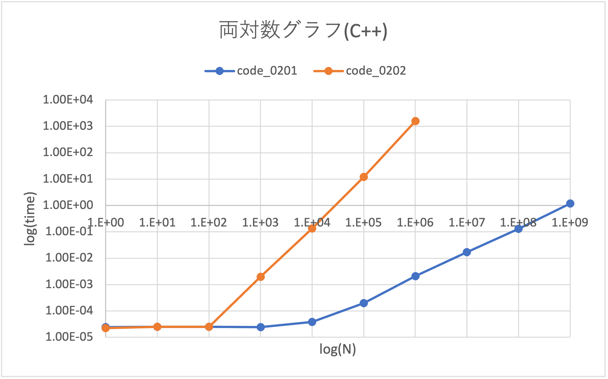
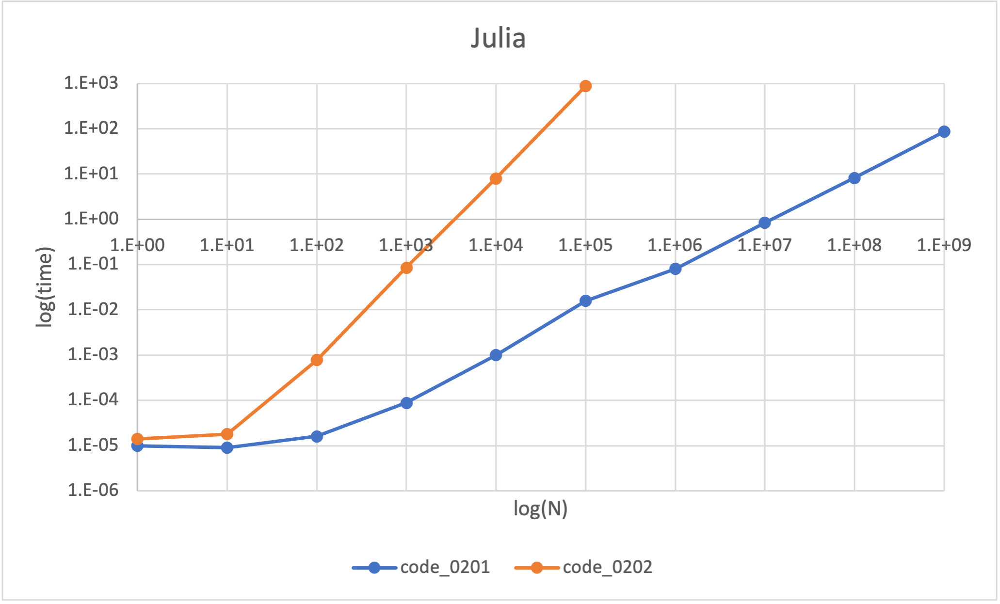
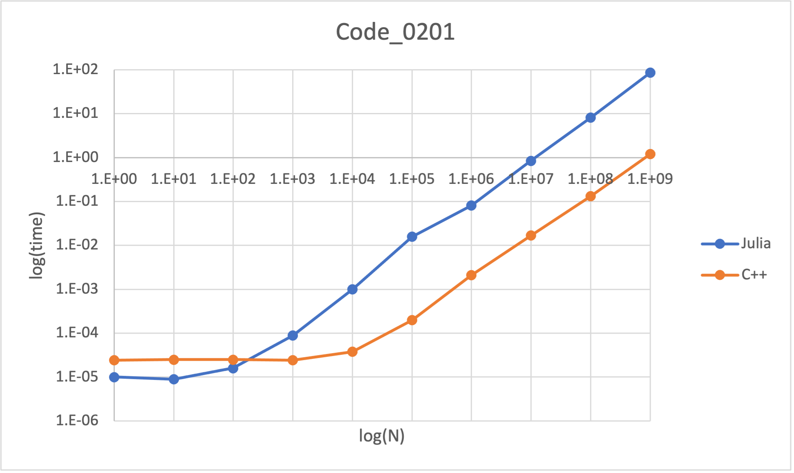
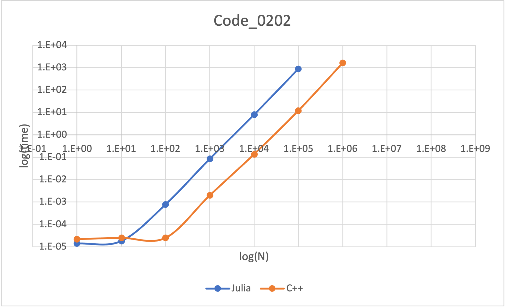

## Algorithms-and-Data-Structures
[アルゴリズムとデータ構造(講談社)](https://www.amazon.co.jp/%E5%95%8F%E9%A1%8C%E8%A7%A3%E6%B1%BA%E5%8A%9B%E3%82%92%E9%8D%9B%E3%81%88%E3%82%8B-%E3%82%A2%E3%83%AB%E3%82%B4%E3%83%AA%E3%82%BA%E3%83%A0%E3%81%A8%E3%83%87%E3%83%BC%E3%82%BF%E6%A7%8B%E9%80%A0-KS%E6%83%85%E5%A0%B1%E7%A7%91%E5%AD%A6%E5%B0%82%E9%96%80%E6%9B%B8-%E5%A4%A7%E6%A7%BB-%E5%85%BC%E8%B3%87/dp/4065128447/ref=pd_lpo_2?pd_rd_i=4065128447&psc=1)中のプログラム．

### 【メモ】まだ解いていない章末問題
#### sec.03
- [ ] 0304
- [ ] 0305 (ABC 081 B)
- [ ] 0306 (ABC 051 B)
- [ ] 0307 (ABC 045 C)

#### sec.04
- [ ] 0403
- [ ] 0405 (ABC 114 C)
- [ ] 0406

### 【メモ】まとめてdocsに残したいもの
- [ ] ~~メモ化の流れ~~
- [ ] テンプレート関数について

### Nの値の増加に伴う計算時間の増加具合(単位：秒)
#### C++

##### code_0201
この計算量は，Nと計算時間がだいたい比例関係　→　計算量は $\mathcal{O}(N)$ と表記する．

##### code_0202
この計算量は，Nと計算時間がだいたい$N^2$と比例関係　→　計算量は $\mathcal{O}(N^2)$ と表記する．

#### Julia

#### C++ と Julia の比較

##### code_0201

##### code_0202

### 最近点対問題

#### 問題
正の整数 N と N個の座標値 $(x_i,y_i)~~(i = 0,1,\dots N-1)$が与えられる．最も距離が近い2点間の距離を求めよ．

#### 例
N = 3 , $(x,y) = A(1,2) , B(2,3) , C(5,2)$ を考える．2点間の距離は

$$
\left|AB\right| = \sqrt{(1-2)^2 + (2-3)^2} = \sqrt{2} \\
\left|AC\right| = \sqrt{(1-5)^2 + (2-2)^2} = 4 \\
\left|BC\right| = \sqrt{(2-5)^2 + (3-2)^2} = \sqrt{10} \\
$$
となり，ABが最近点対となる．

